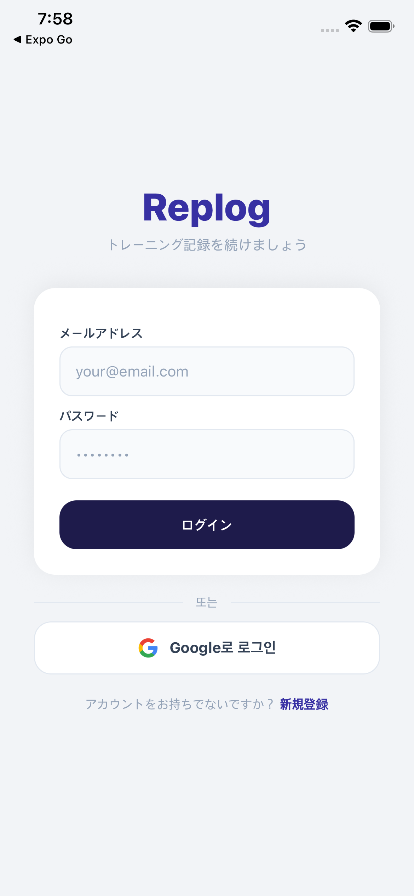
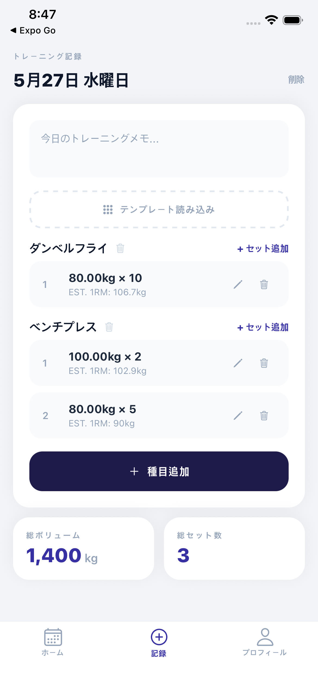
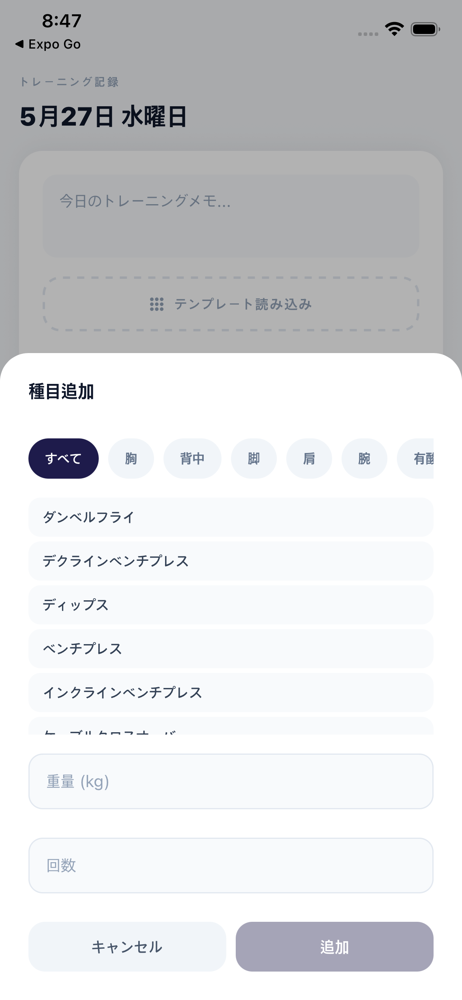
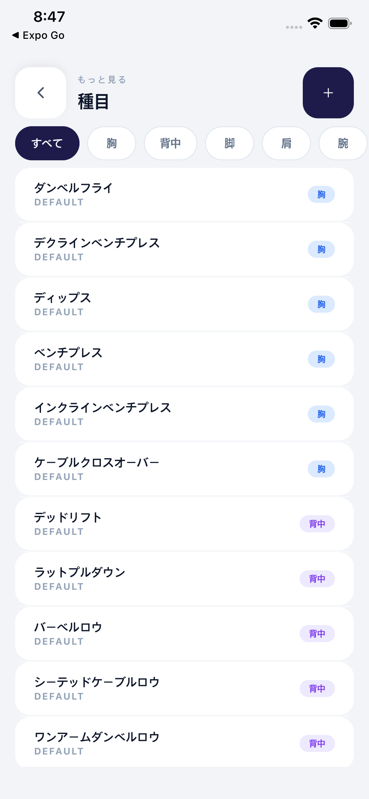
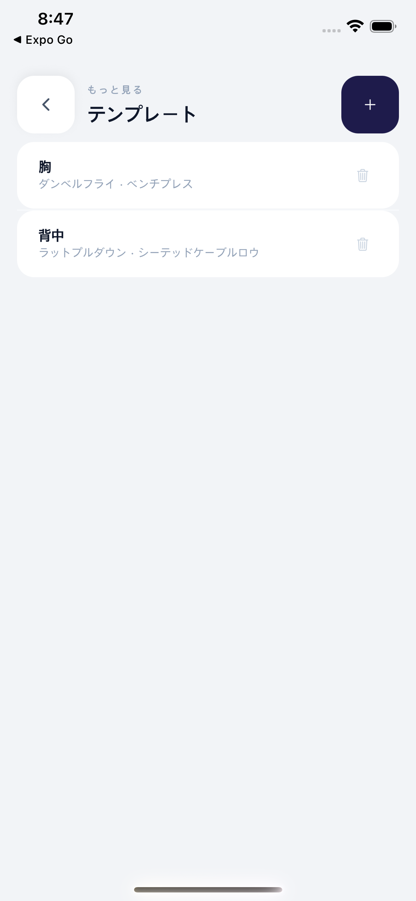
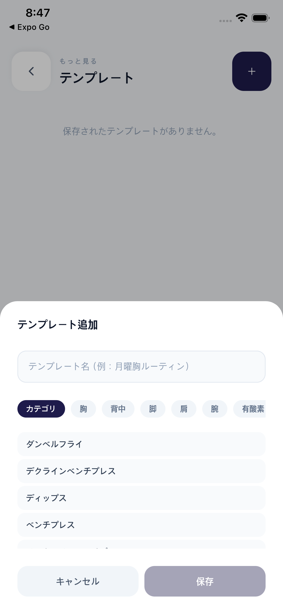
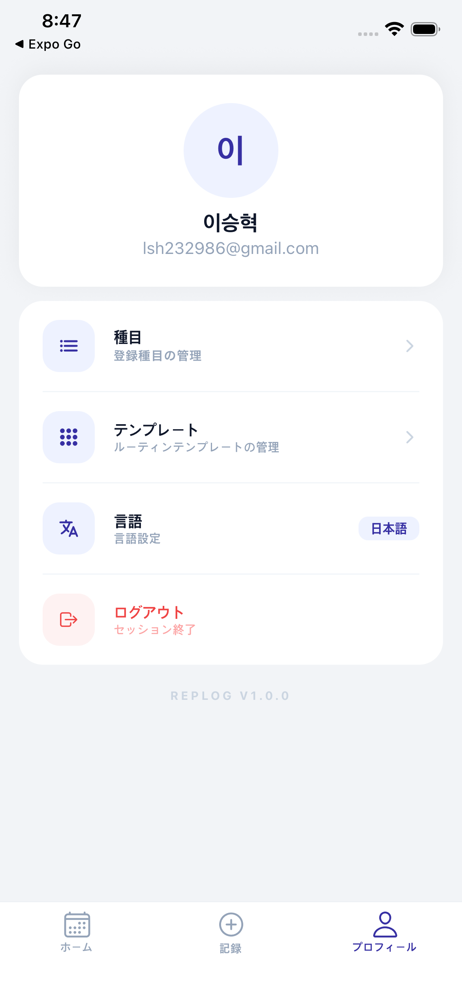
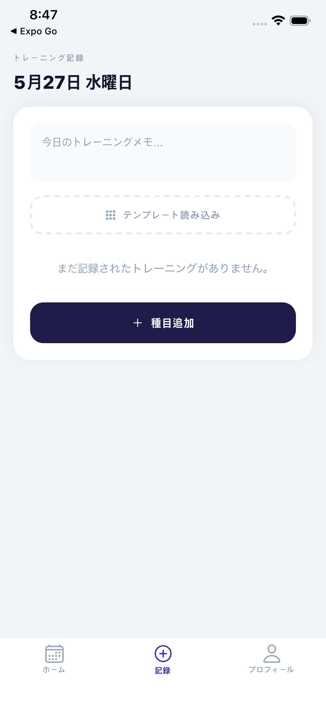
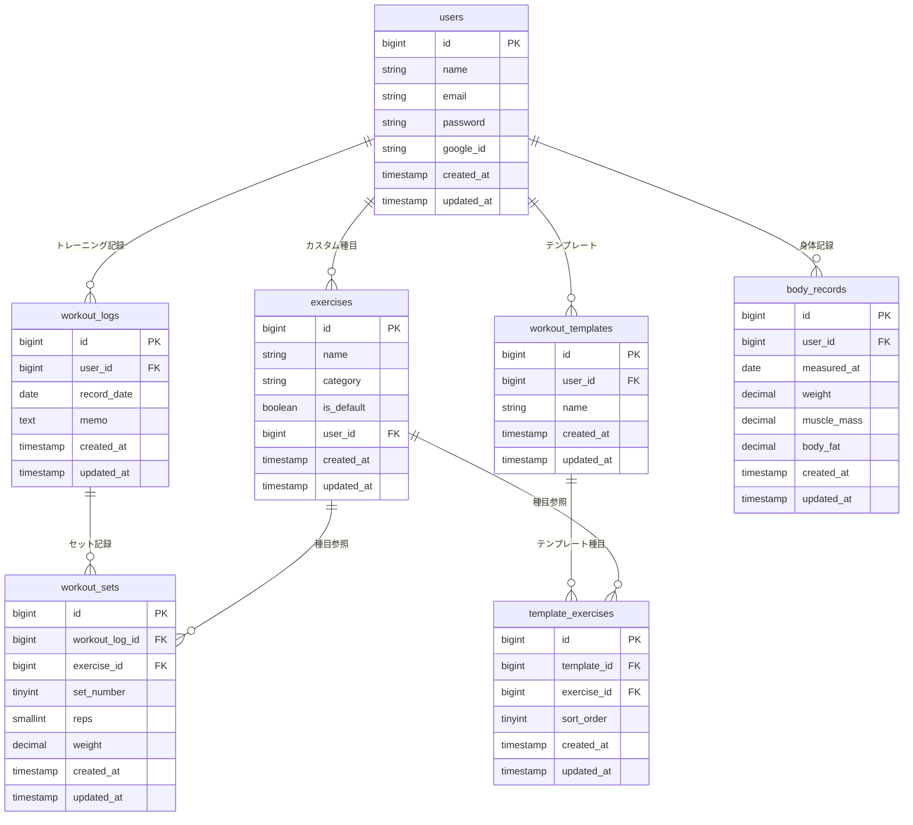

# Replog

**[한국어](./README.md) | [日本語](./README.ja.md)**

> 自分だけのトレーニング記録アプリ — 既存プロジェクト(fit-log-laravel)の構造的な課題を改善したリニューアル版

<br/>

## スクリーンショット

<table>
  <tr>
    <td align="center"><b>ログイン</b></td>
    <td align="center"><b>カレンダー</b></td>
    <td align="center"><b>トレーニング記録</b></td>
  </tr>
  <tr>
    <td></td>
    <td></td>
    <td></td>
  </tr>
  <tr>
    <td align="center"><b>種目追加</b></td>
    <td align="center"><b>種目一覧</b></td>
    <td align="center"><b>テンプレート一覧</b></td>
  </tr>
  <tr>
    <td></td>
    <td></td>
    <td></td>
  </tr>
  <tr>
    <td align="center"><b>テンプレート追加</b></td>
    <td align="center"><b>プロフィール / 言語設定</b></td>
    <td align="center"><b>記録（空状態）</b></td>
  </tr>
  <tr>
    <td></td>
    <td></td>
    <td></td>
  </tr>
</table>

<br/>

## プロジェクト概要

ジムでのトレーニングを日付ごとに記録し、種目別セット数・重量・回数を管理するトレーニング記録モバイルアプリです。

既存プロジェクトでは運動結果をJSONカラムにまとめて保存していましたが、正規化されたテーブル構造に改善し、セットごとの照会・修正・削除および1RM計算が可能なよう再設計しました。

React Native(Expo)モバイルアプリとLaravel REST APIバックエンドで構成され、Railwayを通じて実際のデプロイまで完了したプロジェクトです。

<br/>

## 技術スタック

### Backend
| 技術 | 選定理由 |
|------|----------|
| Laravel 13 | 認証(Sanctum)、ORM(Eloquent)、ルーティングなど標準機能が豊富で迅速なAPI開発が可能 |
| MySQL | 正規化されたリレーショナルデータ構造に適している |
| Laravel Sanctum | トークンベース認証 (Bearer Token) |
| Railway | GitHub連携による自動デプロイ、MySQLサービス込み |

### Mobile
| 技術 | 選定理由 |
|------|----------|
| React Native + Expo SDK 54 | 一つのコードベースでiOS/Androidクロスプラットフォーム対応 |
| EAS Build | Android Studioなしでクラウド上からAPKビルドが可能 |
| @react-native-google-signin/google-signin | ネイティブGoogleソーシャルログイン |
| @tanstack/react-query | APIレスポンスのキャッシュと状態管理 |
| React Navigation v7 | スタック / タブナビゲーション |
| AsyncStorage | トークンのローカル保存 |
| axios | API呼び出しおよび認証インターセプター |

<br/>

## 主な機能

- **カレンダーベースのトレーニング記録** — トレーニングした日付を視覚的に表示、日付クリックで記録にアクセス
- **セットごとの記録** — 種目 / セット / 重量 / 回数の個別管理・修正・削除
- **トレーニングテンプレート** — よく使うルーティンをテンプレートとして保存・読み込み
- **1RM計算** — Brzycki式によるセットごとの推定1RMをインライン表示
- **身体記録** — 体重 / 筋肉量 / 体脂肪率の日付別累積記録
- **種目管理** — デフォルト32種目 + カスタム種目の追加・削除
- **Googleソーシャルログイン** — ネイティブGoogle Sign-In (Android)
- **セッション切れ処理** — 401レスポンス時に自動ログアウト

<br/>

## DB設計

### 既存プロジェクトとの比較・改善点

| 項目 | 既存 | 改善 |
|------|------|------|
| 運動結果の保存 | `workout_results` JSONカラム | `workout_sets` 正規化テーブル |
| テンプレート種目 | `routine_contents` JSONカラム | `template_exercises` 正規化テーブル |
| 身体記録 | `users`テーブルのカラム（1回のみ保存） | `body_records` 別テーブル（日付別累積） |
| デフォルト種目 | ユーザーごとにコピー保存 | `is_default`フラグで共有 |

JSON → 正規化の理由: セットごとの照会・修正・削除が可能、1RM計算をSQLで処理、過去記録の読み込みが容易

### ERD



<br/>

## プロジェクト構成

```
replog/
├── backend/                  Laravel 13 REST API
│   ├── app/
│   │   ├── Http/Controllers/ ドメインごとのコントローラー
│   │   └── Models/           Eloquentモデル（リレーション定義）
│   ├── database/
│   │   ├── migrations/       テーブル定義
│   │   └── seeders/          デフォルト種目32個
│   ├── tests/Feature/        Auth / Exercise / WorkoutLog テスト
│   ├── nixpacks.toml         Railwayビルド設定
│   └── Procfile              Railway実行コマンド
└── mobile/                   React Native + Expo
    └── src/
        ├── api/              axiosベースのAPI呼び出し関数
        ├── components/       共通コンポーネント
        ├── contexts/         グローバル認証状態
        ├── hooks/            カスタムフック（useLogなど）
        ├── navigation/       ナビゲーション構成
        └── screens/          画面別コンポーネント
```

<br/>

## APIエンドポイント

| Method | Endpoint | 説明 |
|--------|----------|------|
| POST | /api/register | 会員登録 |
| POST | /api/login | ログイン |
| POST | /api/auth/google | Googleソーシャルログイン |
| POST | /api/logout | ログアウト |
| GET | /api/exercises | 種目一覧 |
| POST | /api/exercises | カスタム種目追加 |
| DELETE | /api/exercises/:id | 種目削除 |
| GET | /api/workout-logs/calendar | 月別トレーニング日付 |
| GET | /api/workout-logs/:date | 日付別記録照会 |
| POST | /api/workout-logs | 記録作成 |
| POST | /api/workout-logs/:id/sets | セット追加 |
| PUT | /api/workout-logs/:id/sets/:setId | セット修正 |
| DELETE | /api/workout-logs/:id/sets/:setId | セット削除 |
| GET | /api/templates | テンプレート一覧 |
| POST | /api/templates | テンプレート作成 |
| GET | /api/body-records | 身体記録一覧 |
| POST | /api/body-records | 身体記録追加 |

<br/>

## ローカル実行方法

### 事前要件
- PHP 8.4+ / Composer
- Node.js 18+

### Backend
```bash
cd backend
cp .env.example .env
composer install
php artisan key:generate
php artisan migrate:fresh --seed
php artisan serve
```

### Mobile
```bash
cd mobile
npm install
npx expo start
```

<br/>

## デプロイ

| 項目 | サービス |
|------|--------|
| バックエンドAPI | Railway (replog-production.up.railway.app) |
| データベース | Railway MySQL |
| Android APK | EAS Build (expo.dev) |

<br/>

> 既存プロジェクト: [fit-log-laravel](https://github.com/HSeung03/fit-log-laravel)
