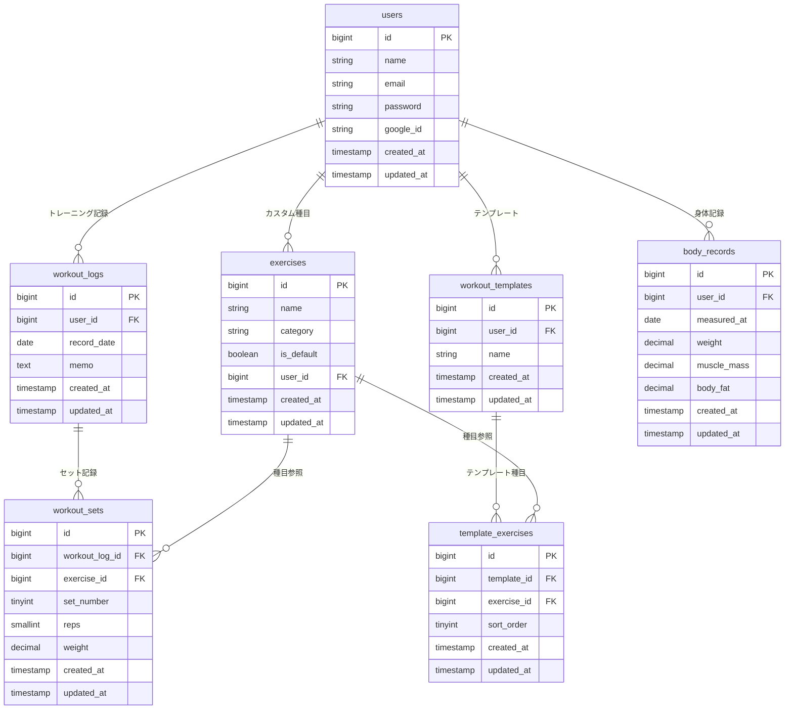

# Replog

**[한국어](./README.md) | [日本語](./README.ja.md)**

> 自分だけのトレーニング記録アプリ — セット・重量・回数を日付ごとに管理するトレーニング記録モバイルアプリ

<br/>

## スクリーンショット

<table>
  <tr>
    <td align="center"><b>ログイン</b></td>
    <td align="center"><b>カレンダー</b></td>
    <td align="center"><b>トレーニング記録</b></td>
  </tr>
  <tr>
    <td></td>
    <td></td>
    <td></td>
  </tr>
  <tr>
    <td align="center"><b>種目追加</b></td>
    <td align="center"><b>種目一覧</b></td>
    <td align="center"><b>テンプレート一覧</b></td>
  </tr>
  <tr>
    <td></td>
    <td></td>
    <td></td>
  </tr>
  <tr>
    <td align="center"><b>テンプレート追加</b></td>
    <td align="center"><b>プロフィール / 言語設定</b></td>
    <td align="center"><b>記録（空状態）</b></td>
  </tr>
  <tr>
    <td></td>
    <td></td>
    <td></td>
  </tr>
</table>

<br/>

## プロジェクト概要

ジムでのトレーニングを日付ごとに記録し、種目別セット数・重量・回数を管理するトレーニング記録モバイルアプリです。

運動結果をセット単位で正規化されたテーブルに保存することで、セットごとの照会・修正・削除および1RM計算が可能な設計にしています。

React Native(Expo)モバイルアプリとLaravel REST APIバックエンドで構成され、AWS EC2にデプロイして実際に稼働中のプロジェクトです。

<br/>

## 技術スタック

### Backend
| 技術 | 選定理由 |
|------|----------|
| Laravel 13 | 認証(Sanctum)、ORM(Eloquent)、ルーティングなど標準機能が豊富で迅速なAPI開発が可能 |
| MySQL | 正規化されたリレーショナルデータ構造に適している |
| Laravel Sanctum | トークンベース認証 (Bearer Token) |
| AWS EC2 | サーバー環境を直接制御できるプロダクション環境 |
| Nginx + PHP-FPM 8.4 | 同時リクエスト処理性能、プロダクション標準構成 |
| Docker + Amazon ECR | デプロイ単位をイメージに固定し、サーバー状態に依存せず同じ結果を保証 |
| GitHub Actions | masterブランチpush時にイメージビルド → ECR push → EC2コンテナ入れ替え (CI/CD) |

### Mobile
| 技術 | 選定理由 |
|------|----------|
| React Native + Expo SDK 54 | 一つのコードベースでiOS/Androidクロスプラットフォーム対応 |
| EAS Build | Android Studioなしでクラウド上からAPKビルドが可能 |
| @react-native-google-signin/google-signin | ネイティブGoogleソーシャルログイン |
| @tanstack/react-query | APIレスポンスのキャッシュと状態管理 |
| React Navigation v7 | スタック / タブナビゲーション |
| AsyncStorage | トークンのローカル保存 |
| axios | API呼び出しおよび認証インターセプター |
| expo-sqlite | オフラインでも記録できるようローカルDBに先に保存 |
| @react-native-community/netinfo | オン・オフライン検知後に同期キューを処理 |
| i18next + react-i18next | 韓国語 / 日本語の多言語対応 |

<br/>

## 主な機能

- **カレンダーベースのトレーニング記録** — トレーニングした日付を視覚的に表示、日付クリックで記録にアクセス
- **セットごとの記録** — 種目 / セット / 重量 / 回数の個別管理・修正・削除
- **トレーニングテンプレート** — よく使うルーティンをテンプレートとして保存・読み込み
- **1RM計算** — Brzycki式によるセットごとの推定1RMをインライン表示
- **オフライン記録** — ローカルSQLiteに先に書き込み、オンライン復帰時に同期キューを順番どおりサーバーへ反映
- **多言語** — 韓国語 / 日本語の切り替え（種目名を含む）
- **種目管理** — デフォルト32種目 + カスタム種目の追加・削除
- **Googleソーシャルログイン** — ネイティブGoogle Sign-In (Android)
- **セッション切れ処理** — 401レスポンス時に自動ログアウト
- **身体記録** — 体重 / 筋肉量 / 体脂肪率の日付別累積記録（バックエンドAPIのみ実装、アプリ画面は未実装）

<br/>

## DB設計

### 設計方針

運動結果をセット単位で分離保存し、個別の修正・削除が可能となるよう正規化構造を採用しました。

| テーブル | 役割 |
|----------|------|
| `workout_sets` | セットごとの重量・回数を個別保存（照会・修正・削除・1RM計算） |
| `template_exercises` | テンプレート種目を正規化テーブルで管理 |
| `body_records` | 身体情報を日付別に累積記録 |
| `exercises.is_default` | デフォルト種目をフラグで共有（ユーザーごとの重複保存を防止） |

### ERD


```mermaid
erDiagram
    users {
        bigint id PK
        string name
        string email
        string password
        string google_id
        timestamp created_at
        timestamp updated_at
    }
    exercises {
        bigint id PK
        string name
        string category
        boolean is_default
        bigint user_id FK
        timestamp created_at
        timestamp updated_at
    }
    workout_logs {
        bigint id PK
        bigint user_id FK
        date record_date
        text memo
        timestamp created_at
        timestamp updated_at
    }
    workout_sets {
        bigint id PK
        bigint workout_log_id FK
        bigint exercise_id FK
        tinyint set_number
        smallint reps
        decimal weight
        timestamp created_at
        timestamp updated_at
    }
    workout_templates {
        bigint id PK
        bigint user_id FK
        string name
        timestamp created_at
        timestamp updated_at
    }
    template_exercises {
        bigint id PK
        bigint template_id FK
        bigint exercise_id FK
        tinyint sort_order
        timestamp created_at
        timestamp updated_at
    }
    body_records {
        bigint id PK
        bigint user_id FK
        date measured_at
        decimal weight
        decimal muscle_mass
        decimal body_fat
        timestamp created_at
        timestamp updated_at
    }

    users ||--o{ exercises : "カスタム種目"
    users ||--o{ workout_logs : "トレーニング記録"
    users ||--o{ workout_templates : "テンプレート"
    users ||--o{ body_records : "身体記録"
    workout_logs ||--o{ workout_sets : "セット記録"
    exercises ||--o{ workout_sets : "種目参照"
    workout_templates ||--o{ template_exercises : "テンプレート種目"
    exercises ||--o{ template_exercises : "種目参照"
```

<br/>

## プロジェクト構成

```
replog/
├── .github/workflows/        GitHub Actions (backend-ci / mobile-ci / deploy)
├── backend/                  Laravel 13 REST API
│   ├── app/
│   │   ├── Http/Controllers/ ドメインごとのコントローラー
│   │   ├── Http/Resources/   レスポンス整形（内部カラムの露出防止）
│   │   ├── Policies/         所有権チェック
│   │   └── Models/           Eloquentモデル（リレーション定義）
│   ├── database/
│   │   ├── migrations/       テーブル定義
│   │   └── seeders/          デフォルト種目32個
│   ├── tests/Feature/        Auth / Exercise / WorkoutLog / 権限 / レート制限テスト
│   └── Dockerfile            デプロイイメージ定義
└── mobile/                   React Native + Expo
    └── src/
        ├── api/              axiosベースのAPI呼び出し関数、クエリキー
        ├── components/       共通コンポーネント（ボタン、シート、フォーム、ヘッダーなど）
        ├── constants/        カテゴリなどの共通定数
        ├── contexts/         グローバル認証状態
        ├── db/               ローカルSQLiteと同期キュー
        ├── hooks/            カスタムフック（useLogなど）
        ├── i18n/             韓国語 / 日本語リソース
        ├── navigation/       ナビゲーション構成
        ├── screens/          画面別コンポーネント
        ├── theme/            色・余白・シャドウのトークン
        └── utils/            日付、1RMなどの純粋関数
```

<br/>

## APIエンドポイント

| Method | Endpoint | 説明 |
|--------|----------|------|
| POST | /api/register | 会員登録 |
| POST | /api/login | ログイン |
| POST | /api/auth/google | Googleソーシャルログイン |
| POST | /api/logout | ログアウト |
| GET | /api/me | ログインユーザー情報 |
| GET | /api/exercises | 種目一覧 |
| POST | /api/exercises | カスタム種目追加 |
| DELETE | /api/exercises/:id | 種目削除 |
| GET | /api/workout-logs/calendar | 月別トレーニング日付 |
| GET | /api/workout-logs/:date | 日付別記録照会 |
| POST | /api/workout-logs | 記録作成 |
| PATCH | /api/workout-logs/:id | 記録メモ修正 |
| DELETE | /api/workout-logs/:id | 記録削除 |
| POST | /api/workout-logs/:id/sets | セット追加 |
| PATCH | /api/workout-logs/:id/sets/:setId | セット修正 |
| DELETE | /api/workout-logs/:id/sets/:setId | セット削除 |
| GET | /api/templates | テンプレート一覧 |
| POST | /api/templates | テンプレート作成 |
| GET | /api/templates/:id | テンプレート詳細 |
| PATCH | /api/templates/:id | テンプレート修正 |
| DELETE | /api/templates/:id | テンプレート削除 |
| GET | /api/body-records | 身体記録一覧 |
| POST | /api/body-records | 身体記録追加 |
| PATCH | /api/body-records/:id | 身体記録修正 |
| DELETE | /api/body-records/:id | 身体記録削除 |

<br/>

## ローカル実行方法

### 事前要件
- PHP 8.4+ / Composer
- Node.js 20+
- Docker (Laravel Sail 利用時)

### Backend
```bash
cd backend
cp .env.example .env
composer install
php artisan key:generate
php artisan migrate:fresh --seed
php artisan serve
```

### Mobile
```bash
cd mobile
npm install
npx expo start
```

<br/>

## デプロイ

| 項目 | サービス |
|------|--------|
| バックエンドAPI | AWS EC2 (replog.servegame.com) |
| Webサーバー | Nginx + PHP-FPM 8.4 |
| SSL | Let's Encrypt (Certbot) |
| データベース | MySQL |
| デプロイイメージ | Docker (Amazon ECR) |
| CI/CD | GitHub Actions (master push → イメージビルド/push → EC2へSSHデプロイ) |
| デプロイの安全装置 | 新コンテナの起動確認後にマイグレーション、失敗時は以前のイメージへロールバック |
| Android APK | EAS Build (expo.dev) |
