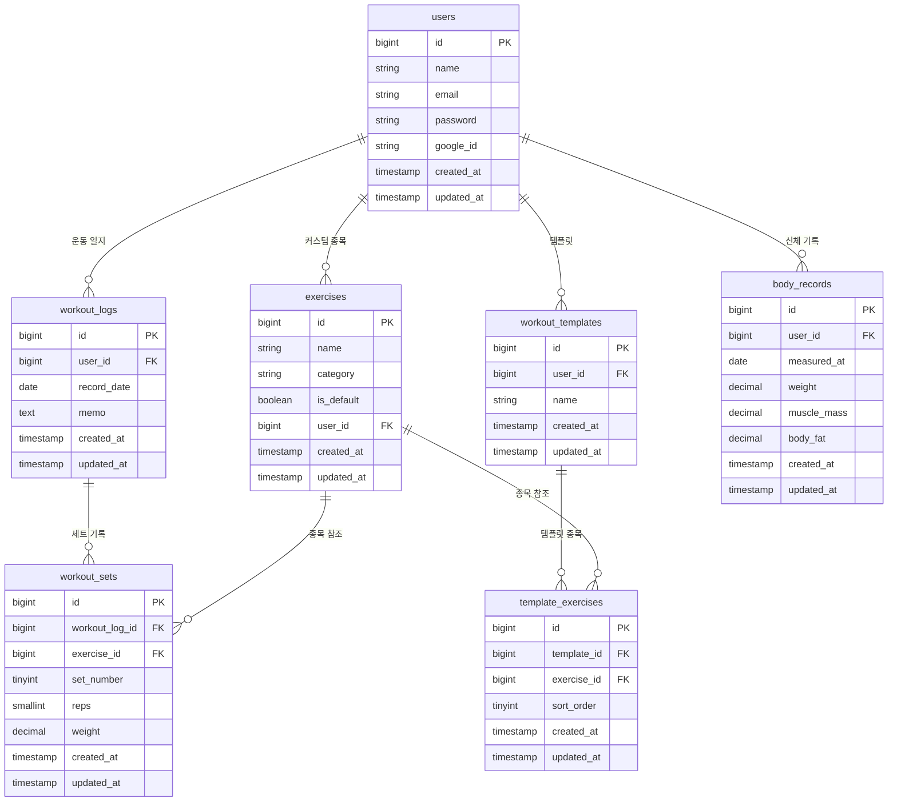

# Replog

**[한국어](./README.md) | [日本語](./README.ja.md)**

> 나만의 운동 기록 일지 — 세트/무게/횟수를 날짜별로 추적하는 운동 기록 모바일 앱

<br/>

## 스크린샷

<table>
  <tr>
    <td align="center"><b>캘린더</b></td>
    <td align="center"><b>로그인</b></td>
    <td align="center"><b>운동 기록</b></td>
  </tr>
  <tr>
    <td></td>
    <td></td>
    <td></td>
  </tr>
  <tr>
    <td align="center"><b>종목 추가</b></td>
    <td align="center"><b>종목 목록</b></td>
    <td align="center"><b>템플릿 목록</b></td>
  </tr>
  <tr>
    <td></td>
    <td></td>
    <td></td>
  </tr>
  <tr>
    <td align="center"><b>템플릿 추가</b></td>
    <td align="center"><b>프로필 / 언어 설정</b></td>
    <td align="center"><b>기록 빈 상태</b></td>
  </tr>
  <tr>
    <td></td>
    <td></td>
    <td></td>
  </tr>
</table>

<br/>

## 프로젝트 소개

헬스장에서 했던 운동을 날짜별로 기록하고, 세트/무게/횟수를 추적하는 운동 기록 모바일 앱입니다.

운동 결과를 세트 단위로 정규화된 테이블에 저장하여 세트별 조회/수정/삭제 및 1RM 계산이 가능하도록 설계했습니다.

React Native(Expo) 모바일 앱과 Laravel REST API 백엔드로 구성되며, AWS EC2에 배포하여 실제 서비스 중인 프로젝트입니다.

<br/>

## 기술 스택

### Backend
| 기술 | 선택 이유 |
|------|----------|
| Laravel 13 | 인증(Sanctum), ORM(Eloquent), 라우팅 등 기본 제공이 풍부해 빠른 API 개발 가능 |
| MySQL | 정규화된 관계형 데이터 구조에 적합 |
| Laravel Sanctum | 토큰 기반 인증 (Bearer Token) |
| AWS EC2 | 서버 환경 직접 제어 가능한 프로덕션 배포 환경 |
| Nginx + PHP-FPM 8.4 | 동시 요청 처리 성능, 프로덕션 표준 구성 |
| GitHub Actions | master 브랜치 push 시 EC2 자동 배포 (CI/CD) |

### Mobile
| 기술 | 선택 이유 |
|------|----------|
| React Native + Expo SDK 54 | 하나의 코드베이스로 iOS/Android 크로스플랫폼 지원 |
| EAS Build | Android Studio 없이 클라우드에서 APK 빌드 가능 |
| @react-native-google-signin/google-signin | 네이티브 구글 소셜 로그인 |
| @tanstack/react-query | API 응답 캐싱 및 상태 관리 |
| React Navigation v7 | 스택 / 탭 네비게이션 |
| AsyncStorage | 토큰 로컬 저장 |
| axios | API 호출 및 인증 인터셉터 |

<br/>

## 주요 기능

- **캘린더 기반 운동 기록** — 운동한 날짜 시각적 표시, 날짜 클릭으로 기록 접근
- **세트별 기록** — 운동 종목 / 세트 / 무게 / 횟수 개별 관리 및 수정/삭제
- **운동 템플릿** — 자주 쓰는 루틴을 템플릿으로 저장하고 불러오기
- **1RM 계산** — Brzycki 공식 기반 세트별 추정 1RM 인라인 표시
- **신체 기록** — 몸무게 / 근육량 / 체지방률 날짜별 누적 기록
- **운동 종목 관리** — 기본 제공 32개 종목 + 커스텀 종목 추가/삭제
- **구글 소셜 로그인** — 네이티브 Google Sign-In (Android)
- **세션 만료 처리** — 401 응답 시 자동 로그아웃

<br/>

## DB 설계

### 설계 원칙

운동 결과를 세트 단위로 분리 저장하여 개별 수정/삭제가 가능하도록 정규화 구조를 채택했습니다.

| 테이블 | 역할 |
|--------|------|
| `workout_sets` | 세트별 무게/횟수 개별 저장 (조회/수정/삭제/1RM 계산) |
| `template_exercises` | 템플릿 종목을 정규화 테이블로 관리 |
| `body_records` | 신체 정보를 날짜별 누적 기록 |
| `exercises.is_default` | 기본 종목을 플래그로 공유 (유저별 중복 저장 방지) |

### ERD



<br/>

## 프로젝트 구조

```
replog/
├── backend/                  Laravel 13 REST API
│   ├── app/
│   │   ├── Http/Controllers/ 각 도메인별 컨트롤러
│   │   └── Models/           Eloquent 모델 (관계 정의)
│   ├── database/
│   │   ├── migrations/       테이블 정의
│   │   └── seeders/          기본 운동 종목 32개
│   ├── tests/Feature/        Auth / Exercise / WorkoutLog 테스트
│   └── .github/workflows/    GitHub Actions CI/CD 설정
└── mobile/                   React Native + Expo
    └── src/
        ├── api/              axios 기반 API 호출 함수
        ├── components/       공통 컴포넌트
        ├── contexts/         전역 인증 상태
        ├── hooks/            커스텀 훅 (useLog 등)
        ├── navigation/       네비게이션 구성
        └── screens/          화면별 컴포넌트
```

<br/>

## API 엔드포인트

| Method | Endpoint | 설명 |
|--------|----------|------|
| POST | /api/register | 회원가입 |
| POST | /api/login | 로그인 |
| POST | /api/auth/google | 구글 소셜 로그인 |
| POST | /api/logout | 로그아웃 |
| GET | /api/exercises | 운동 종목 목록 |
| POST | /api/exercises | 커스텀 종목 추가 |
| DELETE | /api/exercises/:id | 종목 삭제 |
| GET | /api/workout-logs/calendar | 월별 운동 날짜 |
| GET | /api/workout-logs/:date | 날짜별 기록 조회 |
| POST | /api/workout-logs | 일지 생성 |
| POST | /api/workout-logs/:id/sets | 세트 추가 |
| PUT | /api/workout-logs/:id/sets/:setId | 세트 수정 |
| DELETE | /api/workout-logs/:id/sets/:setId | 세트 삭제 |
| GET | /api/templates | 템플릿 목록 |
| POST | /api/templates | 템플릿 생성 |
| GET | /api/body-records | 신체 기록 목록 |
| POST | /api/body-records | 신체 기록 추가 |

<br/>

## 로컬 실행 방법

### 사전 요구사항
- PHP 8.4+ / Composer
- Node.js 18+
- Docker (Laravel Sail 사용 시)

### Backend
```bash
cd backend
cp .env.example .env
composer install
php artisan key:generate
php artisan migrate:fresh --seed
php artisan serve
```

### Mobile
```bash
cd mobile
npm install
npx expo start
```

<br/>

## 배포

| 항목 | 서비스 |
|------|--------|
| 백엔드 API | AWS EC2 (replog.servegame.com) |
| 웹서버 | Nginx + PHP-FPM 8.4 |
| SSL | Let's Encrypt (Certbot) |
| 데이터베이스 | MySQL |
| CI/CD | GitHub Actions (master push → SSH 자동 배포) |
| Android APK | EAS Build (expo.dev) |
