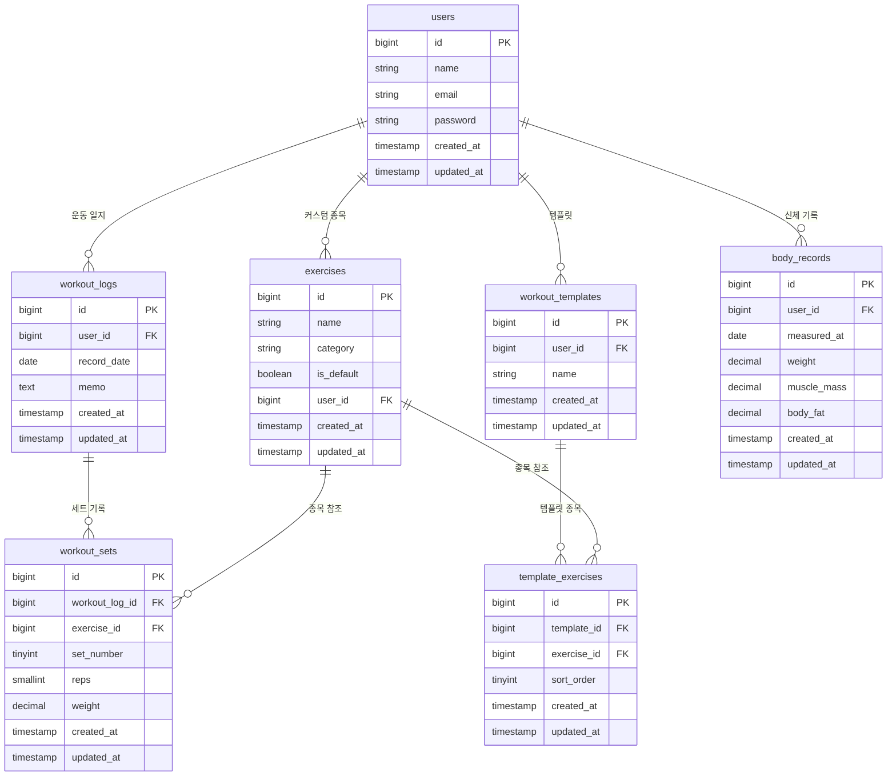

# Replog 🏋️

> 나만의 운동 기록 일지 — 기존 프로젝트(fit-log-laravel)의 구조적 한계를 개선한 리뉴얼 버전

<br/>

## 프로젝트 소개

헬스장에서 했던 운동을 날짜별로 기록하고, 세트/무게/횟수를 추적하며 성장을 시각적으로 확인하는 운동 기록 앱입니다.

기존 프로젝트에서 운동 결과를 JSON 컬럼에 통째로 저장하던 방식을 정규화된 테이블 구조로 개선하여, 세트별 조회/수정/삭제 및 1RM 계산이 가능하도록 재설계했습니다.

웹(PWA)과 모바일(React Native) 두 가지 클라이언트를 동일한 REST API 백엔드로 운영합니다.

<br/>

## 기술 스택

### Backend
| 기술 | 선택 이유 |
|------|----------|
| Laravel 13 | 인증(Sanctum), ORM(Eloquent), 라우팅 등 기본 제공이 풍부해 빠른 개발 가능 |
| MySQL | 정규화된 관계형 데이터 구조에 적합 |
| Laravel Sanctum | SPA 환경에서 토큰 기반 인증 |
| Laravel Socialite | Google OAuth 소셜 로그인 |
| Railway | 백엔드 및 DB 클라우드 배포 |

### Frontend (Web PWA)
| 기술 | 선택 이유 |
|------|----------|
| React 19 + Vite | 컴포넌트 기반 UI, 빠른 개발 서버 |
| Tailwind CSS v4 | 유틸리티 클래스 기반 빠른 스타일링 |
| React Router v7 | SPA 클라이언트 라우팅 |
| lucide-react | 경량 아이콘 라이브러리 |
| axios | API 호출 및 인터셉터 활용 |
| react-i18next | 한국어 / 일본어 다국어 지원 |
| vite-plugin-pwa | PWA 지원 (오프라인 캐싱, 홈 화면 추가) |

### Mobile (React Native)
| 기술 | 선택 이유 |
|------|----------|
| React Native + Expo SDK 54 | 크로스플랫폼 네이티브 앱 |
| React Navigation v7 | 스택 / 탭 네비게이션 |
| @tanstack/react-query | API 응답 캐싱 및 중복 요청 제거 |
| @expo/vector-icons (Ionicons) | 네이티브 아이콘 |
| react-i18next | 한국어 / 일본어 다국어 지원 |
| AsyncStorage | 토큰 로컬 저장 |
| axios | API 호출 |

<br/>

## 주요 기능

- 📅 **캘린더 기반 운동 기록** — 운동한 날짜 시각적 표시, 날짜 클릭으로 기록 접근
- 💪 **세트별 기록** — 운동 종목 / 세트 / 무게 / 횟수 개별 관리
- 📋 **운동 템플릿** — 자주 쓰는 루틴을 템플릿으로 저장
- 🏆 **1RM 챌린지** — 벤치프레스 / 스쿼트 / 데드리프트 최대 1RM 추적 (Brzycki 공식)
- 📊 **신체 기록 그래프** — 몸무게 / 근육량 / 체지방률 추이 시각화
- 🔧 **운동 종목 관리** — 기본 제공 32개 종목 + 커스텀 종목 추가
- 🌐 **다국어 지원** — 한국어 / 일본어
- 🔑 **소셜 로그인** — Google OAuth

<br/>

## DB 설계

### 원본 → 개선 핵심 변경점

| 항목 | 기존 | 개선 |
|------|------|------|
| 운동 결과 저장 | `workout_results` JSON 컬럼 | `workout_sets` 정규화 테이블 |
| 템플릿 종목 | `routine_contents` JSON 컬럼 | `template_exercises` 정규화 테이블 |
| 신체 기록 | `users` 테이블 컬럼 (1회만 저장) | `body_records` 별도 테이블 (날짜별 누적) |
| 기본 종목 | 유저마다 복사 저장 | `is_default` 플래그로 공유 |

JSON → 정규화 이유: 세트별 조회/수정/삭제 가능, 1RM 계산 시 SQL 한 줄로 처리, 이전 기록 불러오기 용이

### ERD



<br/>

## 실행 방법

### 사전 요구사항
- Node.js 18+
- PHP 8.4+ / Composer

### Backend
```bash
cd backend
cp .env.example .env
composer install
php artisan migrate:fresh --seed
php artisan serve
```

### Frontend (Web)
```bash
cd frontend
npm install
npm run dev
```

브라우저에서 `http://localhost:5173` 접속

### Mobile
```bash
cd mobile
npm install
npx expo start
```

Expo Go 앱 또는 iOS 시뮬레이터에서 실행

<br/>

## 프로젝트 구조

```
replog/
├── backend/                  Laravel 13 REST API
│   ├── app/
│   │   ├── Http/Controllers/ 각 도메인별 컨트롤러
│   │   └── Models/           Eloquent 모델 (관계 정의)
│   ├── database/
│   │   ├── migrations/       테이블 정의
│   │   └── seeders/          기본 운동 종목 32개
│   └── routes/api.php        API 엔드포인트
├── frontend/                 React + Vite (PWA)
│   └── src/
│       ├── api/              axios 기반 API 호출 함수
│       ├── contexts/         전역 상태 (인증)
│       ├── components/       공통 컴포넌트
│       └── pages/            페이지별 컴포넌트
└── mobile/                   React Native + Expo
    └── src/
        ├── api/              axios 기반 API 호출 함수
        ├── components/       공통 컴포넌트 (ScreenHeader, BottomSheet)
        ├── contexts/         전역 상태 (인증)
        ├── i18n/             다국어 리소스 (ko, ja)
        ├── navigation/       네비게이션 구성
        └── screens/          화면별 컴포넌트
```

<br/>

## API 엔드포인트

| Method | Endpoint | 설명 |
|--------|----------|------|
| POST | /api/register | 회원가입 |
| POST | /api/login | 로그인 |
| POST | /api/logout | 로그아웃 |
| GET | /api/exercises | 운동 종목 목록 |
| GET | /api/workout-logs/calendar | 월별 운동 날짜 |
| GET | /api/workout-logs/:date | 날짜별 기록 조회 |
| POST | /api/workout-logs/:id/sets | 세트 추가 |
| GET | /api/templates | 템플릿 목록 |
| GET | /api/body-records | 신체 기록 목록 |
| GET | /api/one-rm | 1RM 챌린지 현황 |

<br/>

## 개선 예정

- [ ] 이전 기록 불러오기 (같은 종목의 직전 세트 자동 표시)
- [ ] 운동 통계 페이지
- [ ] Android 빌드 대응

<br/>

> 기존 프로젝트: [fit-log-laravel](https://github.com/HSeung03/fit-log-laravel)
